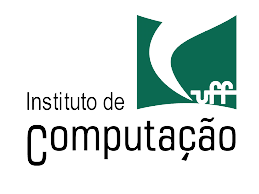

<h1>MONOPOLY</h1>

<b>Objetivo do repositório:</b> armazenar os códigos do trabalho da disciplina Projeto de Software, ministrada em 2024.1.
 
 
<b>Regras do jogo:</b>
<ol>
    <li><b>Objetivo:</b> O objetivo do jogo é se tornar o jogador mais rico, falindo os outros jogadores através da compra, aluguel e negociação de propriedades.
    <li><b>Preparação:</b> Cada jogador recebe uma quantia inicial de dinheiro. As propriedades são colocadas no tabuleiro e cada jogador escolhe uma peça para representá-lo no jogo.
    <li><b>Jogabilidade:</b> 
        <ul>
            <li>Os jogadores lançam os dados e movem suas peças em torno do tabuleiro em sentido horário.
            <li>Quando param em uma propriedade, podem comprá-la se estiver disponível. Se optarem por não comprá-la, ela pode ser leiloada entre os outros jogadores.
            <li>Se um jogador possui todas as propriedades de uma mesma cor, ele pode construir casas e hotéis nelas, aumentando o valor do aluguel.
            <li>Quando um jogador para em uma propriedade de outro jogador, ele deve pagar aluguel ao proprietário da mesma.
            <li>Existem espaços especiais no tabuleiro que podem resultar em ações como tirar uma carta de "Sorte" ou "Cofre", pagar impostos ou até mesmo ser enviado para a prisão.
        </ul>
    <li><b>Eventos Especiais:</b> 
        <ul>
            <li> Existem eventos como "Passar pela Partida" que concedem dinheiro aos jogadores.
            <li> Ir para a prisão pode ocorrer por meio de sorteio de cartas, cair em uma casa específica ou por ultrapassar um certo número de rodadas. O jogador pode sair da prisão pagando uma fiança, tirando um número específico de dados em seus lançamentos ou usando cartas especiais.
        </ul>
    <li><b>Falência e Vencedor:</b> 
        <ul>
            <li>Os jogadores continuam jogando até que todos, exceto um, tenham falido. Isso ocorre quando não podem mais pagar suas dívidas.
            <li>O último jogador restante, que não faliu, é o vencedor.
        </ul>
</ol>
 
<b>Especificações do projeto:</b>
<ul>
    <li>O jogo será programado na linguagem C# + Unity;
    <li>Deverá rodar na seguinte arquitetura: I5-11400H, GTX1650, 8gb RAM;
    <li>Usaremos um diagrama de classes como base para implementação do projeto;
    <li>O jogo terá uma lista de restrições vinculadas ao diagrama de classes, além de um diagrama de sequências para representar o ciclo de uso do jogo. 
</ul>
 
<b>Integrantes do grupo:</b>

| Nome            | GitHub                  | Email                  |
| --------------- | ----------------------- | ---------------------- |
| Amanda S. Zírpolo      | https://github.com/amandazirpolo  | amandazirpolo@id.uff.br |
| Gabriel J. Panza      | https://github.com/Gabriel-Panza/Gabriel-Panza  | gabrieljp@id.uff.br |
| João Vitor de Santana      | https://github.com/Jvssaa  | santanajoao@id.uff.br |
| João Vitor de Moraes      | https://github.com/JohKemPo/JohKemPo  | joaovitormoraes@id.uff.br |

<h6>Professor: <a href="http://profs.ic.uff.br/~troy/index.html">Troy Kohwalter</a></h6>

<h2 align="center">  </h2>

<i align="center">Universidade Federal Fluminense, 2024</i>